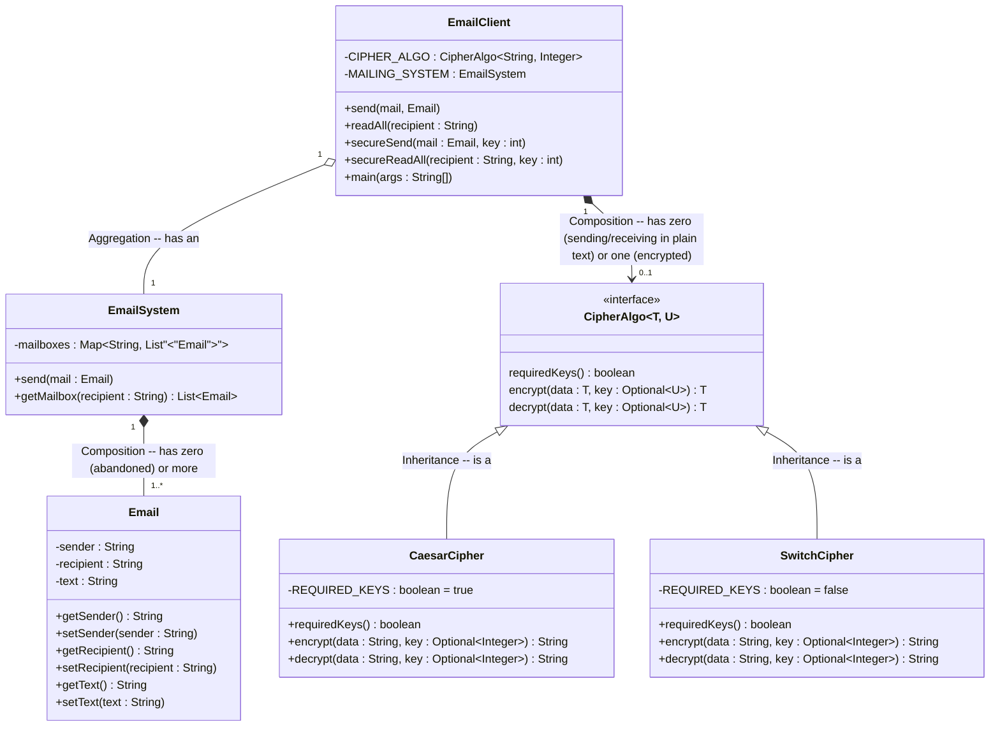

## Output
    >>>>> Read all no encryption
    -----BEGIN MESSAGE-----
    From: Kwan
    To: Kate
    Jgnnq
    -----END MESSAGE-----
    -----BEGIN MESSAGE-----
    From: George
    To: Ken
    iH
    -----END MESSAGE-----
    <<<<< Read all no encryption

    >>>>> Secure read all
    -----BEGIN MESSAGE-----
    From: Kwan
    To: Kate
    Hello
    -----END MESSAGE-----
    -----BEGIN MESSAGE-----
    From: George
    To: Ken
    Hi
    -----END MESSAGE-----
    <<<<< Secure read all

## UML

