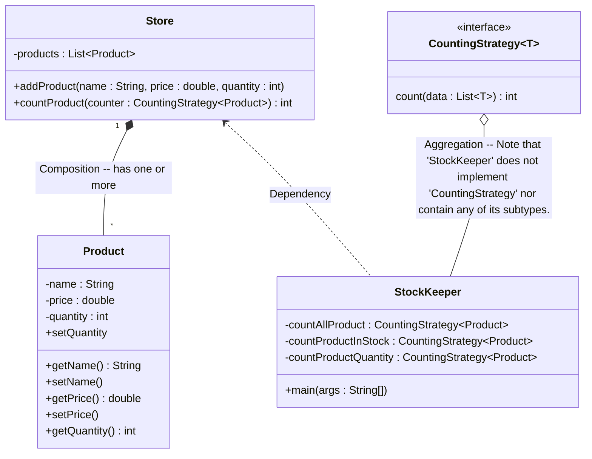

## Output

    All products: 3
    All in-stock: 2
    All of them: 15

## UML

```mermaid
classDiagram

class Product {
    -name : String
    -price : double
    -quantity : int
    +getName() String
    +setName()
    +getPrice() double
    +setPrice()
    +getQuantity() int
    +setQuantity
}

class Store {
    -products : List~Product~
    +addProduct(name : String, price : double, quantity : int)
    +countProduct(counter : CountingStrategy~Product~) int
}

class CountingStrategy~T~ {
    <<interface>>
    count(data : List~T~) int
}

class StockKeeper {
    -countAllProduct : CountingStrategy~Product~
    -countProductInStock : CountingStrategy~Product~
    -countProductQuantity : CountingStrategy~Product~
    +main(args : String[])
}

Store "1" *-- "*" Product: Composition -- has one or more
CountingStrategy o-- StockKeeper: Aggregation -- Note that 'StockKeeper' does not implement 'CountingStrategy' nor contain any of its subtypes.
Store <.. StockKeeper: Dependency
```
